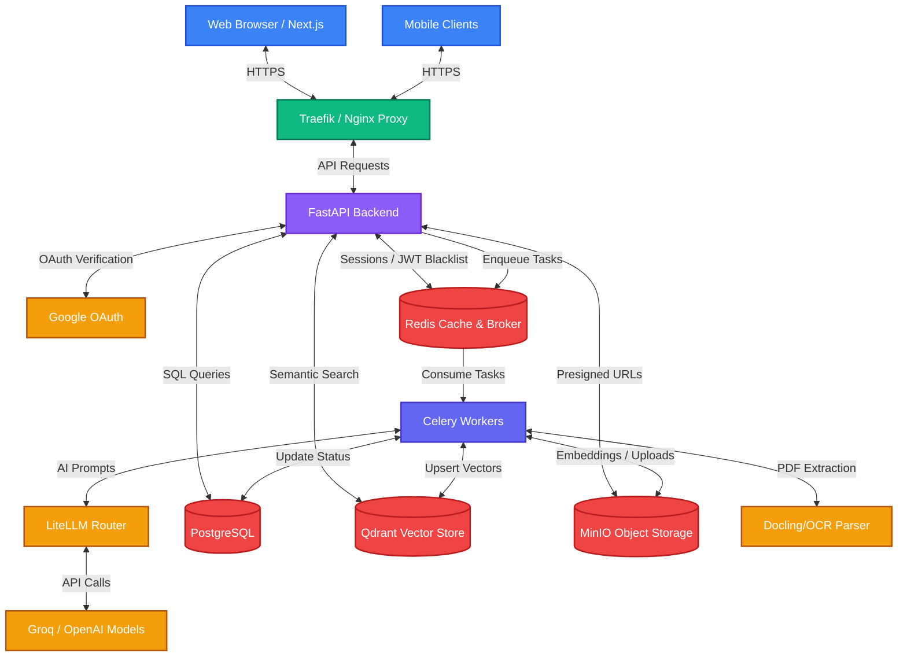

# TalentLens Architecture

This document describes the high-level architecture and data flow of the TalentLens ATS system.

## High-Level Architecture Diagram

## System Components

### 1. Client Layer
- **Next.js (App Router)**: The frontend application is split into two distinct portals (Staff Dashboard and Candidate Portal). It communicates with the backend via REST over HTTPS.

### 2. API & Service Layer
- **FastAPI**: The core backend framework, providing high-performance asynchronous request handling.
- **Dependency Injection**: Used heavily to enforce multi-tenancy. A `get_current_user` dependency automatically extracts the `org_id` from the JWT and injects it into every repository call to prevent cross-tenant data leaks.
- **Casbin**: Enforces RBAC (Role-Based Access Control) across routes using a predefined policy matrix.

### 3. Background Workers (Celery)
Heavy workloads are offloaded to Celery workers via Redis. This prevents long-running operations from blocking the API:
- **Email Sending**: Registration verifications, interview invites, and notification emails.
- **Resume Parsing**: Fetching PDFs from MinIO, running them through Docling, and extracting structured JSON via LLMs.
- **AI Matching**: Processing asynchronous matching jobs across large candidate pools.

### 4. Data Layer
- **PostgreSQL**: The primary relational database holding Organizations, Users, Jobs, Applications, and Audit Logs. Accessed asynchronously via `asyncpg` and SQLAlchemy 2.0.
- **Redis**: Serves a dual purpose as the Celery message broker and a fast cache for session blacklists and LLM response caching.
- **Qdrant**: The vector database powering hybrid search. It stores candidate embeddings and handles metadata filtering (e.g., filtering candidates by `org_id` before performing semantic search).
- **MinIO**: S3-compatible object storage for resumes and candidate assets. The backend issues presigned URLs so clients can upload/download directly without routing massive blobs through FastAPI.

### 5. AI & Extraction Layer
- **LiteLLM**: Acts as an abstraction layer to route prompts to various LLM providers (Groq, OpenAI, Anthropic).
- **Instructor**: Validates and coerces LLM outputs into strictly typed Pydantic models (e.g., extracting a `ResumeParsedData` object from unstructured text).
- **Sentence-Transformers**: Generates `BGE-small` dense vectors for candidate resumes and job descriptions locally.
- **Docling / Tesseract**: Converts complex layout PDFs and scanned images into markdown chunks suitable for LLM processing.

## Security Boundaries
1. **Multi-Tenancy**: Every ORM repository call is implicitly scoped to `WHERE org_id = :current_org_id`.
2. **Dual Portals**: Candidate JWTs and Staff JWTs are structurally distinct. A candidate cannot replay their token against a staff endpoint.
3. **Deterministic SQL**: AI Copilot natural language queries are parsed into constrained JSON filters *before* they touch the database. The system never executes LLM-generated SQL directly.
