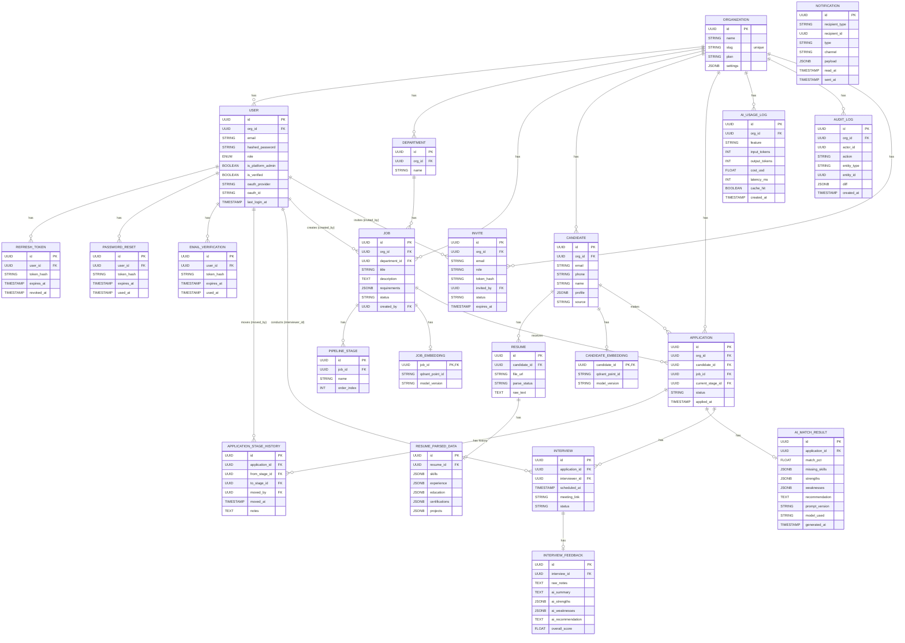

# Entity-Relationship (ER) Diagram

Below is the initial Entity-Relationship diagram for the AI Talent Acquisition Platform, based on the schema outlined in the project plan. 

```mermaid
erDiagram
    %% Common fields omitted for brevity: created_at, updated_at, created_by, updated_by, deleted_at
    
    ORGANIZATION {
        UUID id PK
        STRING name
        STRING slug "unique"
        STRING plan
        JSONB settings
    }

    USER {
        UUID id PK
        UUID org_id FK
        STRING email
        STRING hashed_password
        ENUM role
        BOOLEAN is_platform_admin
        BOOLEAN is_verified
        STRING oauth_provider
        STRING oauth_id
        TIMESTAMP last_login_at
    }

    REFRESH_TOKEN {
        UUID id PK
        UUID user_id FK
        STRING token_hash
        TIMESTAMP expires_at
        TIMESTAMP revoked_at
    }

    PASSWORD_RESET {
        UUID id PK
        UUID user_id FK
        STRING token_hash
        TIMESTAMP expires_at
        TIMESTAMP used_at
    }

    EMAIL_VERIFICATION {
        UUID id PK
        UUID user_id FK
        STRING token_hash
        TIMESTAMP expires_at
        TIMESTAMP used_at
    }

    INVITE {
        UUID id PK
        UUID org_id FK
        STRING email
        STRING role
        STRING token_hash
        UUID invited_by FK
        STRING status
        TIMESTAMP expires_at
    }

    DEPARTMENT {
        UUID id PK
        UUID org_id FK
        STRING name
    }

    JOB {
        UUID id PK
        UUID org_id FK
        UUID department_id FK
        STRING title
        TEXT description
        JSONB requirements
        STRING status
        UUID created_by FK
    }

    PIPELINE_STAGE {
        UUID id PK
        UUID job_id FK
        STRING name
        INT order_index
    }

    JOB_EMBEDDING {
        UUID job_id PK, FK
        STRING qdrant_point_id
        STRING model_version
    }

    CANDIDATE {
        UUID id PK
        UUID org_id FK
        STRING email
        STRING phone
        STRING name
        JSONB profile
        STRING source
    }

    RESUME {
        UUID id PK
        UUID candidate_id FK
        STRING file_url
        STRING parse_status
        TEXT raw_text
    }

    RESUME_PARSED_DATA {
        UUID id PK
        UUID resume_id FK
        JSONB skills
        JSONB experience
        JSONB education
        JSONB certifications
        JSONB projects
    }

    CANDIDATE_EMBEDDING {
        UUID candidate_id PK, FK
        STRING qdrant_point_id
        STRING model_version
    }

    APPLICATION {
        UUID id PK
        UUID org_id FK
        UUID candidate_id FK
        UUID job_id FK
        UUID current_stage_id FK
        STRING status
        TIMESTAMP applied_at
    }

    APPLICATION_STAGE_HISTORY {
        UUID id PK
        UUID application_id FK
        UUID from_stage_id FK
        UUID to_stage_id FK
        UUID moved_by FK
        TIMESTAMP moved_at
        TEXT notes
    }

    AI_MATCH_RESULT {
        UUID id PK
        UUID application_id FK
        FLOAT match_pct
        JSONB missing_skills
        JSONB strengths
        JSONB weaknesses
        TEXT recommendation
        STRING prompt_version
        STRING model_used
        TIMESTAMP generated_at
    }

    AI_USAGE_LOG {
        UUID id PK
        UUID org_id FK
        STRING feature
        INT input_tokens
        INT output_tokens
        FLOAT cost_usd
        INT latency_ms
        BOOLEAN cache_hit
        TIMESTAMP created_at
    }

    INTERVIEW {
        UUID id PK
        UUID application_id FK
        UUID interviewer_id FK
        TIMESTAMP scheduled_at
        STRING meeting_link
        STRING status
    }

    INTERVIEW_FEEDBACK {
        UUID id PK
        UUID interview_id FK
        TEXT raw_notes
        TEXT ai_summary
        JSONB ai_strengths
        JSONB ai_weaknesses
        TEXT ai_recommendation
        FLOAT overall_score
    }

    NOTIFICATION {
        UUID id PK
        STRING recipient_type
        UUID recipient_id
        STRING type
        STRING channel
        JSONB payload
        TIMESTAMP read_at
        TIMESTAMP sent_at
    }

    AUDIT_LOG {
        UUID id PK
        UUID org_id FK
        UUID actor_id
        STRING action
        STRING entity_type
        UUID entity_id
        JSONB diff
        TIMESTAMP created_at
    }

    %% Relationships
    ORGANIZATION ||--o{ USER : "has"
    ORGANIZATION ||--o{ DEPARTMENT : "has"
    ORGANIZATION ||--o{ JOB : "has"
    ORGANIZATION ||--o{ CANDIDATE : "has"
    ORGANIZATION ||--o{ APPLICATION : "has"
    ORGANIZATION ||--o{ AI_USAGE_LOG : "has"
    ORGANIZATION ||--o{ AUDIT_LOG : "has"
    
    USER ||--o{ REFRESH_TOKEN : "has"
    USER ||--o{ PASSWORD_RESET : "has"
    USER ||--o{ EMAIL_VERIFICATION : "has"
    
    DEPARTMENT ||--o{ JOB : "has"
    
    JOB ||--o{ PIPELINE_STAGE : "has"
    JOB ||--o| JOB_EMBEDDING : "has"
    JOB ||--o{ APPLICATION : "receives"
    
    CANDIDATE ||--o{ RESUME : "has"
    CANDIDATE ||--o| CANDIDATE_EMBEDDING : "has"
    CANDIDATE ||--o{ APPLICATION : "makes"
    
    RESUME ||--o| RESUME_PARSED_DATA : "has"
    
    APPLICATION ||--o{ APPLICATION_STAGE_HISTORY : "has history"
    APPLICATION ||--o| AI_MATCH_RESULT : "has"
    APPLICATION ||--o{ INTERVIEW : "has"
    
    INTERVIEW ||--o| INTERVIEW_FEEDBACK : "has"
    
    USER ||--o{ APPLICATION_STAGE_HISTORY : "moves (moved_by)"
    USER ||--o{ INTERVIEW : "conducts (interviewer_id)"
    USER ||--o{ JOB : "creates (created_by)"
    
    ORGANIZATION ||--o{ INVITE : "has"
    USER ||--o{ INVITE : "invites (invited_by)"
```
